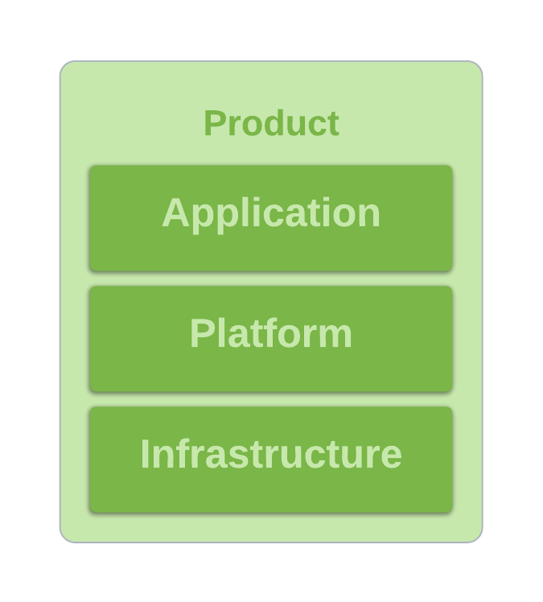

# platform
## introduction
This repository contains the reusable components for the Consulting Kubernetes-based platform, see [11FSConsulting/infra](https://github.com/11fsconsulting/infra) for our 'golden' baseline configuration from which new Platforms can be created. 

A software component is often broken down into three tiers;
* Application, the code containing business logic and presentation material that the end-users interface with and that runs on the platform.
* Platform, the glue components that enable the applications to function, providing an abstraction to the infrastructure and enriching the developer experience.
* Infrastructure, the hardware, operating systems or cloud abstractions that are used in order to run the platform.

In order to make our lives easier in Consulting and save our engineers time we have collected together several open source and 11:FS-authored components that make up the Platform and (some of) the Infrastructure of this model. We also provide, as a component, the means to import these components individually into current platforms and the means to spin up a known configuration that can provide the baseline Platform for any new project. All components are provided entirely in code with documentation and can be fully individually customized for implementation requirements.

## application-platform interface
We have chosen **Kubernetes** as the interface for the Application -> Platform connection. Out of the box, we provide automated pipelines in order to:
* Automatically [gather](https://github.com/11FSConsulting/platform/tree/master/components/client-repo-gather-deps) and update structs from this repository into a user-defined configuration (though it is suggested that a new Platform uses a copy of [11FSConsulting/infra](https://github.com/11FSConsulting/infra/blob/master/manifest.yaml), our sandbox cluster, as a starting point).
* Automatically deploy and update the configured platform using [Tekton](https://github.com/11FSConsulting/platform/tree/master/k8s/tekton-pipelines), keeping the state in line with the configuration contained in the platform instance's GitHub repository.
* Automatically deploy and update application components from their own GitHub repositories and manage the software application lifecycle via GitHub Actions across multiple environments. FIXME: This isn't pushed yet, TODO push it!

This means that from the perspective of a developer, day to day application changes can be conducted with no dependency or requirements on Platform changes. Of course, occasional adjustments are still required on the Platform and can be made via 1..m layers of overlay configurations using `Kustomize` and `Helm` as code that is visible, auditable and managed within Git repositories. 

## infrastructure-platform interface
So far, we've deployed our Platform using [**Amazon Web Services**](https://github.com/11FSConsulting/platform/blob/master/docs/AWS-newCluster.md) via `kops` and [**Oracle Cloud Infrastructure**](https://www.terraform.io/docs/providers/oci/r/containerengine_cluster.html) via Terraform with the ability to create new environments within **1 day** and have ready-made templates and processes for both platforms. That said, there are no particular barriers to adding the capabiity to run on any other Infrastructure - we have built the Platform with this in mind. Any dependencies on particular cloud resources are indicated by a prefix (eg. aws-) and though we assume AWS in some cases, upstream documentation generally provides a way to adapt configuration in order to serve other platforms. If it runs Kubernetes, we can deploy this Platform on it!

## how do I use this?
The best starting point is the [AWS new cluster tutorial](https://github.com/11FSConsulting/platform/blob/master/docs/AWS-newCluster.md) and to use the [sandbox cluster](https://github.com/11fsconsulting/infra) as a reference - it's a repository template, easy to make a copy of. Note that our primary audience is still Platform Engineers - we're working to make this more accessible and will do our best in order to improve current documentation and to keep it up to date. In the mean time, you can reach out to any of the Platform team on Slack at #team-consulting-eng-platform with any questions or comments. 

More information on structs and their usage can be found [here](https://github.com/11FSConsulting/platform/blob/master/docs/structs.md).

## how do I find what I need here?
* `.github/workflows` contains our validation workflow, incorporating the code that builds our Platform Docker image that validates, tests and renders components on client repositories.
* `components` contains several re-usable components that don't fit in elsewhere, eg. `client-repo-gather-deps` is the CI code that automatically pulls in changes to this repository on client repositories, `sonatype-nexus` is our custom base image for the repository management system and `infra-tester` is the base code for the Platform Docker image mentioned above.
* `k8s` contains all of our Kubernetes Platform components. Examples would be `loki` for serving logs, `prometheus` for Kubernetes monitoring and `kafka` for our Kubernetes-managed Kafka solution using Strimzi's Kafka distribution and operator.
* `terraform` contains all of our reusable Terraform modules. Examples would be `aws-cloudtrail` that enforces a logging trail on AWS accounts, `aws-ses` that creates an AWS Simple Email Service for sending out email notifications to users or `oci-mailer` that creates noreply type mailers in Oracle Cloud.
* `build.sh` is the code that validates and renders all code that enters this repository. It is run on the client repository side whenever an update is made to their platform code in order to pull any required updates in from this repository.

## versioning
The [CalVer](https://calver.org/#scheme) scheme is used to construct tag names. The format is 'YY.0M.0D' with optional '-<number>' for intra-day updates.
